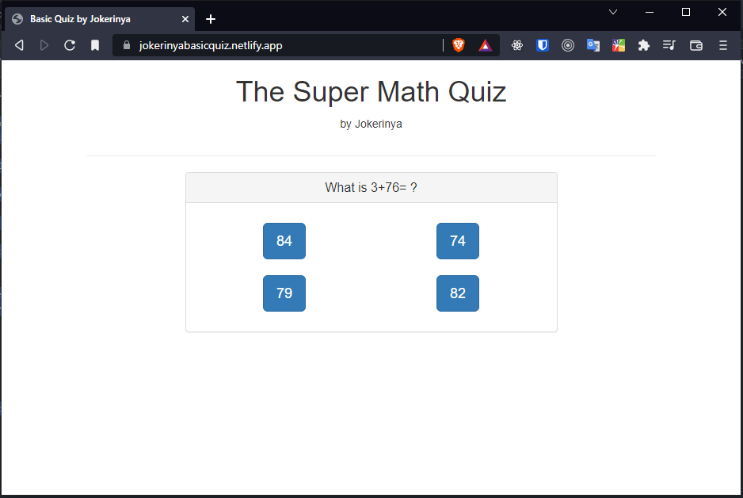

# Basic Math Quiz

This `basic math quiz` has been made with `VueJS` and `Bootstrap4`.

This is a self-learning small project that has been done with <a href="https://www.udemy.com/course/vuejs-2-the-complete-guide/" target="_blank">Acedemind</a> `VueJS` course. _It was a really great course_.

> 👉This site is online at <a href="https://jokerinyabasicquiz.netlify.app/" target="_blank">here</a>.



## In this course I learned,

- VueJS setup,
- Bootstrap4,
- VueJS animation,
- Coding Algorithm,
- And many more.

I have learned lots of things with this **_small but effective project_**.

**_It was one of the first courses that I finished when I started coding._**

## Build Setup

```bash
# install dependencies
npm install

# serve with hot reload at localhost:8080
npm run dev

# build for production with minification
npm run build
```

For detailed explanation on how things work, consult the [docs for vue-loader](http://vuejs.github.io/vue-loader).
